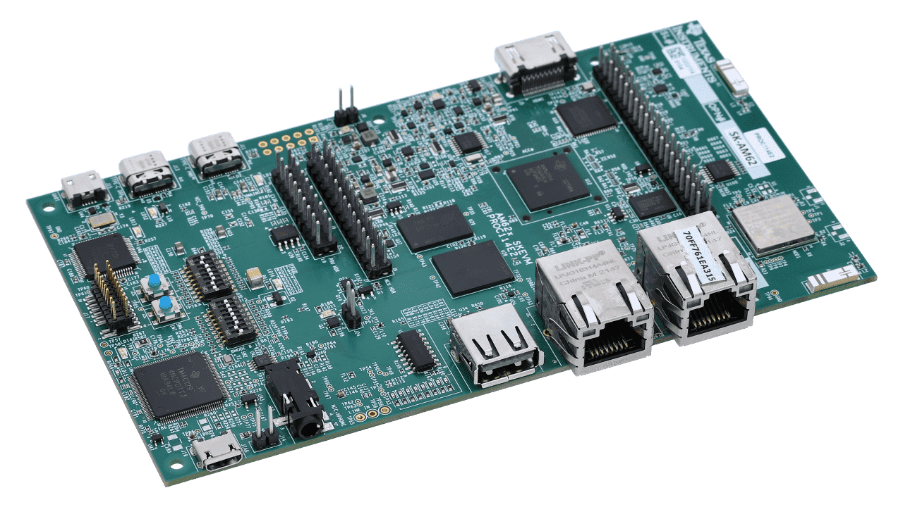

# TI AM62x SKEVM aka AM62xx-EVM

*This is a work in progress.*

This is the base Nerves System configuration for the [TI AM62x SKEVM](#sk-am62).

 [Image credit](#ti)

| Feature              | Description                                |
| -------------------- | ------------------------------------------ |
| CPU                  | 1.4 GHz quad-core Cortex-A53 (64-bit mode) |
| Memory               | 2 GB DDR4                                  |
| Storage              | MicroSD                                    |
| Linux kernel         | TBD                                        |
| IEx terminal         | UART `ttyS1`                               |
| GPIO, I2C, SPI       | Yes - [Elixir Circuits](https://github.com/elixir-circuits) |
| ADC                  | No                                         |
| Ethernet             | Yes                                        |
| WiFi                 | Onboard WiFi                               |
| RTC                  | No                                         |
| HW Watchdog          | Yes                                        |

[Image credit](#sk-am62): This image is from [ti.com](https://www.ti.com/tool/SK-AM62).
